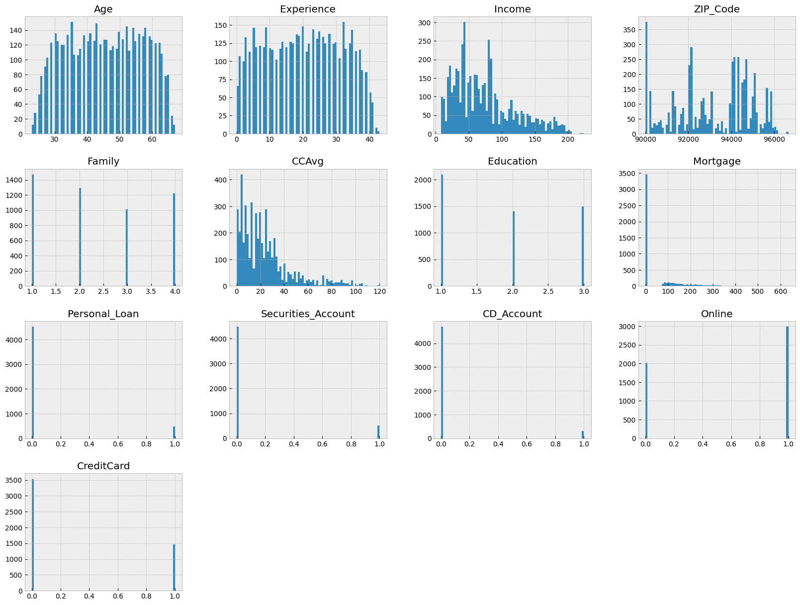
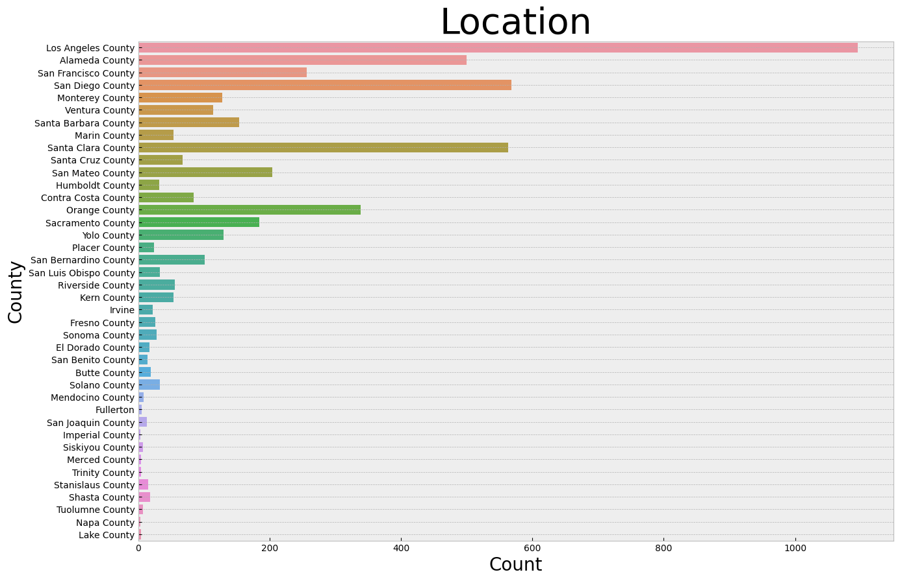
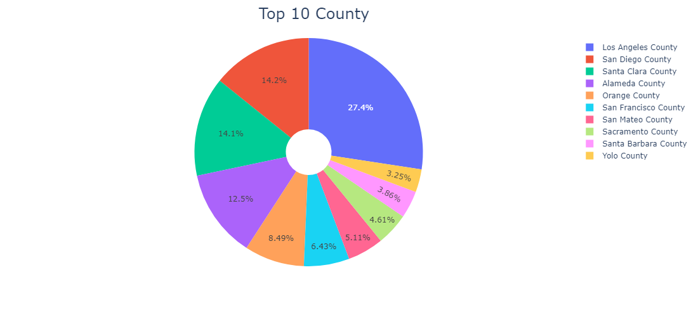
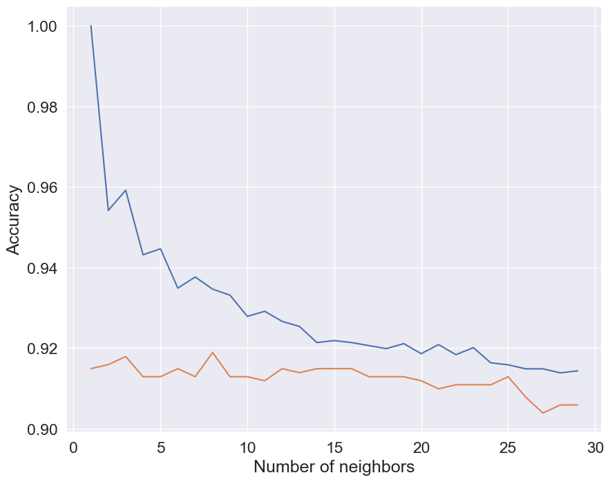
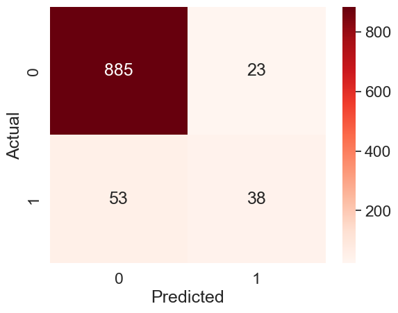
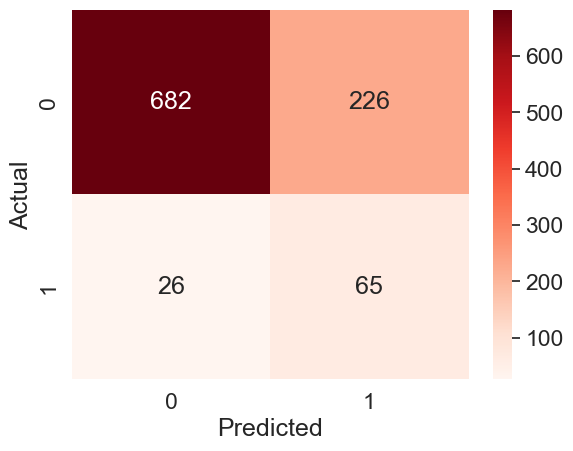
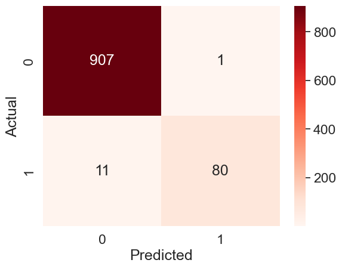

# Bank Loan offer
Nowadays, the identification of customers and how to approach them is of utmost importance. Companies strive to determine the likelihood of customers accepting an offer before making it, enabling them to provide the most suitable offer to their customers.
In this dataset, we have numerous bank customers, each with their own set of characteristics. Ultimately, we aim to determine whether these customers have accepted previous loan offers from the bank or not. By developing an accurate model, we can predict whether another individual, to whom we are considering making a proposal, will accept or decline our offer.

## Step 1
Necessary Libraries: Lists the libraries required for the project, such as pandas, numpy, matplotlib, seaborn, plotly, scikit-learn, and the zipcodes.

## Step 2
Dataset: Refers to the loading of the dataset, but the specific details are missing.

## Step 3
Preprocessing: Covers various preprocessing tasks, including handling missing values, duplicated values, derived metrics, visualization, outliers, and normalization.

## Step 4
Modeling: Find an optimized model of supervised learning by deploying LogisticRegression, KNN, Complement Naive Bayes, Decision Tree classifier and Random Forest classifier algorithms

### LogisticRegression

### KNN

### Complement Naive Bayes

### Decision Tree classifier

### Random Forest classifier

## After conducting an analysis of different machine learning algorithms and assessing their scores and error rates, it has been concluded that the Random Forest classifier is the optimal algorithm for the "Bank_Personal_Loan" dataset.
